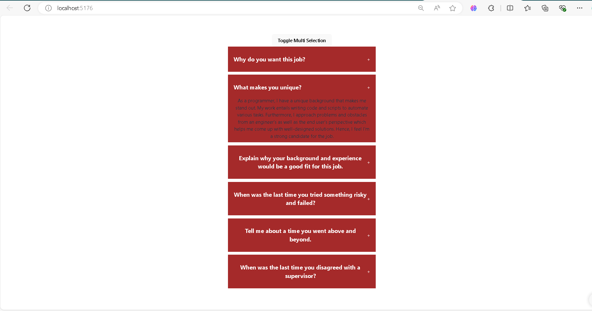

# Toggle/Enable Multiple Selections Mini Project

This project demonstrates how to toggle between single and multiple selections from an expandable list using React.js. Users can choose to either select one item at a time or enable multiple selections by toggling a button. This provides a dynamic and flexible user interface for handling various options.

## Features

- **Single and Multiple Selections**: Users can toggle between single selection and multi-selection modes.
- **Expandable List**: Each item in the list can be expanded or collapsed to show more details.
- **Responsive Design**: Adapts smoothly to different screen sizes.

## Demo

Here's a screenshot of the Toggle Multi Selection system in action:



## Installation

1. Clone this repository:
   ```bash
   git clone <repository-url>
   cd toggle-multi-selection-project


Open the project in your browser at http://localhost:3000.

## Technologies Used
- React.js: Frontend framework for building interactive UI.
- CSS: For styling and layout of the expandable items.

## Usage
- Use the toggle button to switch between single and multiple selection modes.
- Expand any of the items to reveal more details.
- Choose between selecting one or more items at a time, based on the toggle state.

## Made with ❤️ by Saket
