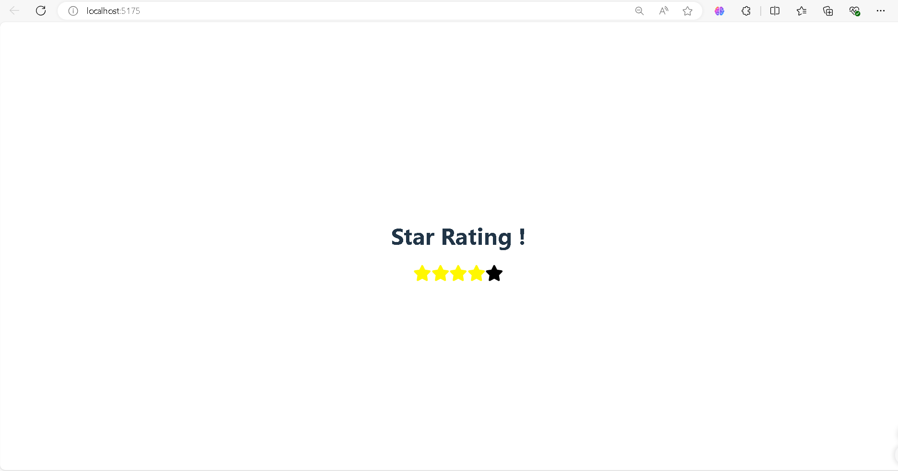

# Star Rating Mini Project

This project showcases a simple and elegant Star Rating system implemented using React.js. Users can interact with a set of 5 stars, and based on their rating, the stars change color. The stars turn yellow on hover, and when a rating is selected, the corresponding number of stars remain yellow, representing the user's rating.

## Features

- **Interactive Rating**: Users can hover over stars and click to select their rating.
- **Dynamic UI**: Stars change color based on user interaction.
- **Responsive**: Adjusts smoothly to different screen sizes.

## Demo

Here's a screenshot of the Star Rating system in action:



## Installation

1. Clone this repository:
   ```bash
   git clone <repository-url>
   cd star-rating-mini-project
   ```

2. Install dependencies:
   ```bash
   npm install
   ```

3. Run the project:
   ```bash
   npm start
   ```

4. Open the project in your browser at `http://localhost:3000`.

## Technologies Used

- **React.js**: Frontend framework for building the interactive UI.
- **CSS**: For styling the stars and layout.

## Usage

When hovering over the stars, they turn yellow. Clicking on a star selects the rating. For example, if a user selects 4 stars, the first 4 stars turn yellow, while the 5th star remains blank.

## Made with ❤️ by Saket
